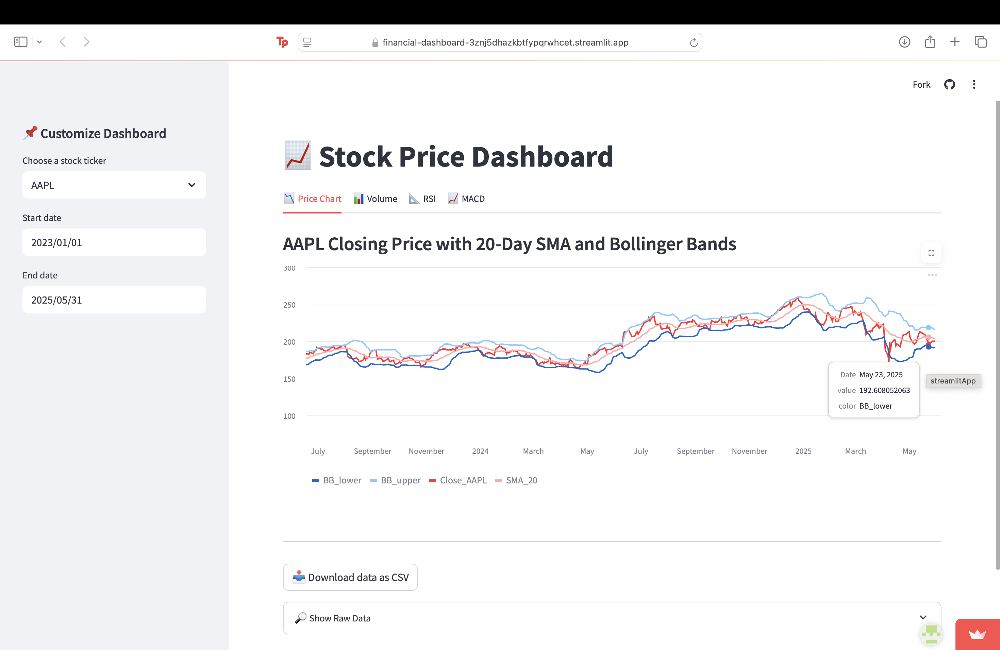

# 📈 Financial Dashboard

A sleek, interactive stock analysis dashboard built with Streamlit and powered by real-time Yahoo Finance data via `yfinance`.

## 🚀 Features

- **Dynamic Stock Selection:** Choose from popular tickers like AAPL, GOOG, TSLA, etc.
- **Custom Date Range:** Define your analysis window.
- **Price Analysis:** Closing price with 20-day SMA and Bollinger Bands.
- **Volume Chart:** Daily traded volume.
- **RSI Indicator:** 14-day RSI with auto-generated trading insights.
- **MACD Indicator:** Momentum and trend-following signals.
- **📥 Download CSV:** Export processed data for personal use.

## 📸 Dashboard Preview

 <!-- Optional: Add after deployment -->

## 🛠️ Tech Stack

- Python
- Streamlit
- yfinance
- pandas / numpy
- Git & GitLab

## 💡 How to Run Locally

```bash
git clone https://github.com/aaronmalhi/financial-dashboard.git
cd financial-dashboard
pip install -r requirements.txt
streamlit run app.py
